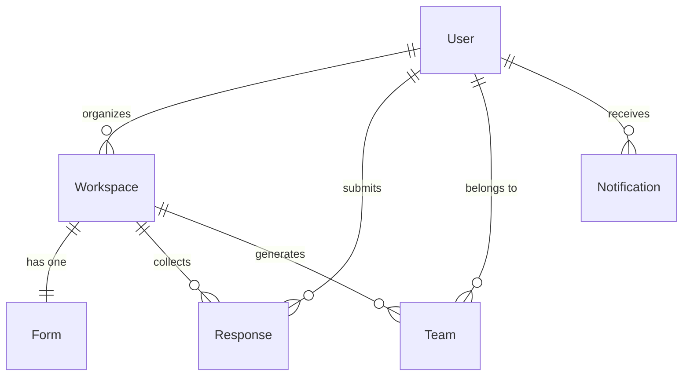

# gMatch — Database Schema

MongoDB Atlas with Mongoose ODM. All models are in `apps/server/src/models/`.

---

## Entity Relationship Diagram



---

## Models

### User
Represents anyone who logs in (organizer or participant).

| Field           | Type     | Notes                                               |
|-----------------|----------|-----------------------------------------------------|
| `_id`           | ObjectId | Auto-generated                                      |
| `name`          | String   | Required, trimmed                                   |
| `email`         | String   | Required, unique, lowercase                         |
| `avatar`        | String   | Profile image URL                                   |
| `role`          | String   | `"organizer"` or `"participant"`, null until chosen |
| `portfolioUrls` | [String] | Optional array of links                             |
| `oauthProvider` | String   | `"google"` or `"github"`                            |
| `oauthId`       | String   | ID from the OAuth provider                          |
| `createdAt`     | Date     | Auto (timestamps)                                   |
| `updatedAt`     | Date     | Auto (timestamps)                                   |

---

### Workspace
A course or project space created by an organizer.

| Field          | Type     | Notes                                               |
|----------------|----------|-----------------------------------------------------|
| `_id`          | ObjectId | Auto-generated                                      |
| `organizerId`  | ObjectId | Ref → User (who created it)                         |
| `name`         | String   | Required, trimmed                                   |
| `template`     | String   | `"software-engineering"`, `"business-case-study"`, `"study-group"`, `"hackathon"`, or `"blank"` |
| `teamSize`     | Number   | Required, min 2                                     |
| `requiredTags` | [String] | Tags used by the matching algorithm                 |
| `inviteCode`   | String   | Unique, exactly 6 characters                        |
| `status`       | String   | `"open"` → `"matching"` → `"published"`             |
| `createdAt`    | Date     | Auto                                                |
| `updatedAt`    | Date     | Auto                                                |

**Lifecycle:** When created, status is `"open"` and participants can join. Organizer triggers matching → `"matching"`, then publishes → `"published"`.

---

### Form
The survey attached to a workspace. One form per workspace.

| Field         | Type     | Notes                                               |
|---------------|----------|-----------------------------------------------------|
| `_id`         | ObjectId | Auto-generated                                      |
| `workspaceId` | ObjectId | Ref → Workspace                                     |
| `questions`   | Array    | Subdocuments (see below)                            |
| `createdAt`   | Date     | Auto                                                |
| `updatedAt`   | Date     | Auto                                                |

**Question subdocument:**

| Field     | Type     | Notes                                               |
|-----------|----------|-----------------------------------------------------|
| `id`      | String   | Unique within the form (e.g. `"q1"`)                |
| `type`    | String   | `"multiple-choice"`, `"availability-grid"`, or `"skill-tag"` |
| `label`   | String   | The question text                                   |
| `tag`     | String   | Algorithm tag (e.g. `"frontend"`, `"backend"`)    |
| `options` | [String] | Choices for multiple-choice questions               |

---

### Response
One response per participant per workspace.

| Field              | Type     | Notes                                               |
|--------------------|----------|-----------------------------------------------------|
| `_id`              | ObjectId | Auto-generated                                      |
| `workspaceId`      | ObjectId | Ref → Workspace                                     |
| `participantId`    | ObjectId | Ref → User                                          |
| `answers`          | Array    | `{ questionId: String, value: Mixed }`              |
| `availabilityGrid` | Mixed    | Flexible object (e.g. `{ "Monday": [9,10,11], "Tuesday": [14,15] }`) |
| `whitelistEmails`  | [String] | Emails of preferred teammates                       |
| `blacklistEmails`  | [String] | Emails of incompatible teammates                    |
| `createdAt`        | Date     | Auto                                                |
| `updatedAt`        | Date     | Auto                                                |

---

### Team
A generated team after the matching algorithm runs.

| Field         | Type       | Notes                                               |
|---------------|------------|-----------------------------------------------------|
| `_id`         | ObjectId   | Auto-generated                                      |
| `workspaceId` | ObjectId   | Ref → Workspace                                     |
| `memberIds`   | [ObjectId] | Refs → User                                         |
| `chatHistory` | Array      | Subdocuments (see below)                            |
| `createdAt`   | Date       | Auto                                                |
| `updatedAt`   | Date       | Auto                                                |

**Chat message subdocument:**

| Field     | Type     | Notes                                               |
|-----------|----------|-----------------------------------------------------|
| `senderId`  | ObjectId | Ref → User                                          |
| `message`   | String   | Message content                                     |
| `timestamp` | Date     | Defaults to `Date.now`                              |

---

### Notification
In-app notifications pushed to users.

| Field       | Type     | Notes                                               |
|-------------|----------|-----------------------------------------------------|
| `_id`       | ObjectId | Auto-generated                                      |
| `userId`    | ObjectId | Ref → User                                          |
| `message`   | String   | Notification text                                   |
| `read`      | Boolean  | Default: `false`                                    |
| `createdAt` | Date     | Default: `Date.now`                                 |

---

## How It All Connects

1. **Organizer** signs up → `User` document created with `role: "organizer"`
2. Organizer creates a **Workspace** → generates a 6-char `inviteCode`
3. Organizer builds a **Form** → questions array saved to one Form per workspace
4. **Participant** joins via invite code → `User` document created with `role: "participant"`
5. Participant fills out the form → **Response** document saved
6. Organizer runs matching → algorithm reads all Responses, generates **Team** documents
7. Teams are published → **Notifications** sent to all participants
8. Team members chat → messages pushed to `Team.chatHistory`

---

## Connection Config

In `apps/server/src/config/db.js`:

```js
const connectDB = require("./config/db");
await connectDB(); // reads MONGODB_URI from process.env
```

The health check at `GET /api/health` returns `"db": "connected"` or `"db": "disconnected"`.
